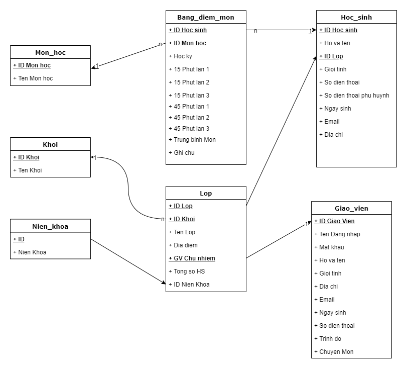

## Language and Module

| # 	| <br>Tool & Modules 	|
|---	|--------------------	|
| 1 	| Python             	|
| 2 	| Bootstrap          	|
| 3 	| Java Script         |
| 4 	| Jquery              |
| 4 	| Flask              	|
| 5 	| Flask-WTFform      	|
| 6 	| Flask-SQLAlchemy   	|
| 7 	| Flask-Mail         	|

## Task sheet

| #  	| Task                                                                   	| 
|----	|------------------------------------------------------------------------	|
| 1  	| Phát triển Templates                                                   	| 
| 2  	| Template admin page, DS Lớp, DS Học sinh,<br>bảng điểm, Thời Khóa biểu 	| 
| 3  	| Template trang chủ, quản lý trường, liên hệ                            	| 
| 4  	| Template trang học sinh, sự kiện, lịch thi                             	| 
| 5  	| Thiết kế model/database                                                	| 
| 6  	| Tính năng đăng nhập/đăng xuất                                          	| 
| 7  	| Tính năng đổi mật khẩu                                                 	|
| 8  	| Tính năng Giáo vụ xem/sửa thông tin lớp                                	|
| 9  	| Tính năng Giáo vụ xem/sửa thông tin học sinh                           	|
| 10 	| Tính năng Giáo viên chấm điểm                                          	| 
| 11 	| Tính năng Giáo vụ chỉnh sửa thông tin học sinh/giáo viên               	| 
| 12 	| Tính năng Thời khóa biểu                                               	| 
| 13 	| Tính năng quản lý lịch thi                                             	| 
| 14 	| Tính năng quản lý sự kiện                                              	|
| 15 	| Tính năng liên hệ trường                                               	| 
| 16 	| Tính năng quản vụ thêm/xem giáo viên                                   	| 
| 17 	| Tính năng quản vụ thêm/xem học sinh                                    	| 

## Project 

## How to install and run
1.  Clone the Repository
```bash
git clone  https://github.com/Kiienn149/SS2.git
```
3.  Navigate to the Project Directory
```bash
cd your-repo-name/SS2/app_school
```
4.  Create and Activate Virtual Environment
```bash
python -m venv venv
```
Activate the virtual environment:

On Windows:
```bash
venv\Scripts\activate
```
On macOS/Linux:

```bash
source venv/bin/activate
```
5.  Install Required Packages
```bash
cd ..
pip install -r requirements.txt
```
6.  Run the Application
```bash
python runserver.py
```
